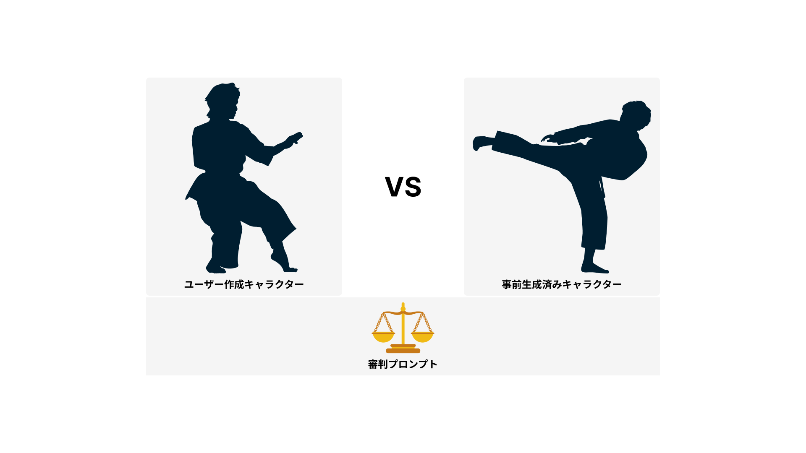
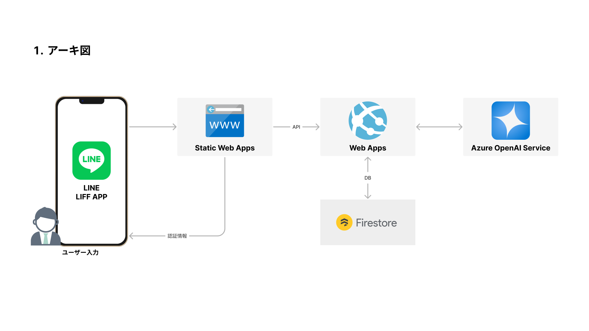

# 2024 LINE バックエンド

## [ブログ記事：LINE×生成AI：チャットバトルゲームを作る！](https://tech-lab.sios.jp/archives/43089)


## 紹介

アプリケーションの紹介です。詳細は[こちらのブログ](https://tech-lab.sios.jp/archives/43089)を読んでもらえるとうれしいです。

### ゲームコンセプト

生成AIを使ってキャラクター同士を戦わせる公式LINEです。



### アーキテクト図

構成としてはAzureでの実装に寄っています。



データベースにFirestoreを使用しています。こちらは無料枠が結構あるので、小さなアプリケーションには最適です。

- [フロントエンド](https://github.com/Ryunosuke-Tanaka-sti/2024-line-liff-app-frontend)
- [バックエンド](https://github.com/Ryunosuke-Tanaka-sti/2024-line-liff-app-backend)

### 使用ライブラリ

詳細は、package.jsonをご覧ください。

## リポジトリについて

詳細については、問い合わせていただけると助かります。興味があればいつ出mお連絡待ってます( *´艸｀)

[http://localhost:3000](http://localhost:3000)にAPIがホストされる。

## ディレクトリ構造

```txt
.
├── Dockerfile              :
├── docker-compose.yml      :
├── backend/                : Nest.jsプログラム
└── README.md               : 
```

### 起動方法

こちらは、VSCodeのDevContainerの機能を使って環境を作成しています。Dockerの入っている環境にCloneして立ち上げてね。

それ以外の方は以下のコマンドに従ってください。

```bash
cd backend

cp .env.sample .env
# 自分の環境の環境変数に変更（量が多いので説明は省きます）

npm install

npm run dev
```
